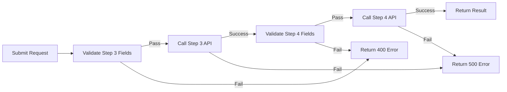

# 🏠 Dokicasa Integration Microservice (NestJS)

A lightweight NestJS microservice that connects **Zappyrent** with **Dokicasa** APIs for automatic contract form submission (Steps **3** and **4**) across **Milano**, **Roma**, and **Torino**.

---

## 🚀 Features

- ✅ Built with **NestJS + TypeScript**
- ✅ Validates required fields per **city** and **contract type**
- ✅ Sequential validation: Step 3 → Step 4
- ✅ Calls Dokicasa API endpoints:
  - Step 3 → `locazione-*` (form submission)
  - Step 4 → `creazione-documenti-*` (document creation)
- ✅ Field-level mapping for each city/contract type combination
- ✅ Comprehensive error handling with detailed feedback
- ✅ Fully covered by **unit tests** (Jest + ts-jest)
- ✅ RESTful API with automatic validation

---

## 📁 Project Structure

```
src/
├── app.module.ts           # Root module
├── main.ts                  # Application entry point
├── config/                  # Configuration module
│   └── config.module.ts
├── dokicasa/               # Core Dokicasa integration
│   ├── dokicasa.controller.ts
│   ├── dokicasa.service.ts
│   ├── dokicasa.module.ts
│   ├── form-resolver.service.ts
│   ├── dto/
│   │   └── submit-client-payload.dto.ts
│   └── *.spec.ts          # Unit tests
├── http/                   # HTTP client wrapper
│   ├── http.service.ts
│   └── http.module.ts
└── mapping/                # Field mapping & validation
    ├── mapping.service.ts
    ├── required-fields.ts
    └── *.spec.ts
```

---

## 📦 Installation

### Prerequisites

- Node.js >= 18.x
- npm or yarn

### Setup

```bash
# Clone the repository
git clone <repository-url>

# Navigate to the project directory
cd dokicasa-nestjs

# Install dependencies
npm install

# Create .env file (see Environment Variables section)
cp .env.example .env
```

---

## ⚙️ Environment Variables

Create a `.env` file in the root directory:

```env
# Dokicasa API Configuration
DOKICASA_TOKEN=your_dokicasa_bearer_token
DOKICASA_BASE_URL=https://app.dokicasa.it
DOKICASA_TIMEOUT_MS=30000

# Server Configuration
PORT=8080
```

### Required Variables

- `DOKICASA_TOKEN` - Your Dokicasa API Bearer token (required)
- `DOKICASA_BASE_URL` - Dokicasa API base URL (default: `https://app.dokicasa.it`)
- `DOKICASA_TIMEOUT_MS` - HTTP request timeout in milliseconds (default: `15000`)
- `PORT` - Server port (default: `8080`)

---

## 🚀 Running the Application

### Development Mode

```bash
npm run start:dev
```

The application will start with hot-reload enabled and listen on `http://localhost:8080`

### Production Mode

```bash
# Build the project
npm run build

# Start the application
npm start
```

---

## 📡 API Endpoints

### Base URL

All endpoints are prefixed with `/api/v1`

### Submit Contract Information

**Endpoint:** `POST /api/v1/submit-contract-info`

**Description:** Validates and submits contract information to Dokicasa, executing both Step 3 (form submission) and Step 4 (document creation) sequentially.

**Request Body:**

```json
{
  "city": "milano",
  "contract_type": "locazione-3-2-canone",
  "fields": {
    "tipologia_locazione_11_5": "Il Contratto riguarda l'intero immobile",
    "durata_anni_2_6": "3+2",
    "data_decorrenza_locazione_3_1_3_3_6": "2025-11-01",
    "importo_mensile_locazione_6_5": 1000,
    "pagamento_canone_3_2_6": 5,
    "metodo_pagamento_34_6": "Tramite bonifico bancario"
    // ... more fields required for Step 3
  },
  "creation_fields": {
    "tipologia_locazione_20_4": "Viene affittato l'intero immobile",
    "tipologia_contratto_14_5": "Contratto Agevolato (3/4/5/6 + 2 anni)",
    "domanda_arredi_12": "No, non è arredato",
    "domanda_note_22_5": "No, va bene così"
    // ... more fields required for Step 4
  }
}
```

**Supported Cities:**

- `milano`
- `roma`
- `torino`

**Supported Contract Types:**

- `locazione-3-2-canone`
- `locazione-transitoria-canone`
- `locazione-studenti-universitari`

**Success Response (200):**

```json
{
  "ok": true,
  "city": "milano",
  "contract_type": "locazione-3-2-canone",
  "step3": {
    "id": "FORM123",
    "status": "submitted"
  },
  "step4": {
    "documentId": "DOC999",
    "status": "created"
  }
}
```

**Error Responses:**

- `400 Bad Request` - Missing required fields or validation errors
- `500 Internal Server Error` - API errors from Dokicasa

**Error Response Example:**

```json
{
  "statusCode": 400,
  "message": "Missing required fields for Step 3",
  "details": {
    "step3": {
      "missing": ["importo_mensile_locazione_6_5", "durata_anni_2_6"]
    }
  }
}
```

---

## 🧪 Testing

### Run All Tests

```bash
npm test
```

### Run Tests in Watch Mode

```bash
npm run test:watch
```

### Run Tests with Coverage

```bash
npm run test:cov
```

### Test Structure

- **Unit Tests**: Service and controller tests using Jest mocks
- **Integration Tests**: E2E tests with supertest for endpoint testing
- **Coverage**: All services maintain high test coverage

---

## 🔧 Development

### Architecture

The application follows a modular architecture:

1. **Controller Layer** (`dokicasa.controller.ts`)
   - Handles HTTP requests and responses
   - Validates input using DTOs

2. **Service Layer** (`dokicasa.service.ts`)
   - Business logic and orchestration
   - Sequential validation: Step 3 → Step 4
   - Error handling and API communication

3. **Data Mapping** (`mapping.service.ts`)
   - Maps client data to Dokicasa field structure
   - City and contract-type specific mappings

4. **Form Resolution** (`form-resolver.service.ts`)
   - Resolves correct API endpoints per city/contract type
   - Dynamic URL generation

5. **Required Fields** (`required-fields.ts`)
   - Registry of required fields per city/contract type
   - Validates completeness before API calls

### Sequential Validation Flow



### Adding New Contract Types

1. Add contract type to `required-fields.ts`:
   ```typescript
   export const REQUIRED_REGISTRY = {
     [city]: {
       'new-contract-type': {
         step3: ['field1', 'field2', ...],
         step4: [...]
       }
     }
   }
   ```

2. Update `SubmitClientPayloadDto` with new contract type
3. Add tests in `dokicasa.service.spec.ts`

---

## 📝 Scripts

| Command | Description |
|---------|-------------|
| `npm start` | Start production server |
| `npm run start:dev` | Start development server with hot-reload |
| `npm test` | Run all tests |
| `npm run test:watch` | Run tests in watch mode |
| `npm run test:cov` | Run tests with coverage report |
| `npm run build` | Build for production |

---

## 🛠️ Technologies Used

- **Framework**: NestJS 10.x
- **Language**: TypeScript 5.x
- **HTTP Client**: Axios
- **Validation**: class-validator, class-transformer
- **Testing**: Jest, ts-jest, supertest
- **Environment**: dotenv

---

## 📄 License

This project is private and proprietary.

---

## 🤝 Contributing

This is a private repository for internal use only.

---

## 📞 Support

For issues or questions, please contact the development team.
